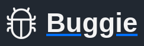

<!-- Improved compatibility of back to top link: See: https://github.com/othneildrew/Best-README-Template/pull/73 -->

<a name="readme-top"></a>

<!--
*** Thanks for checking out the Best-README-Template. If you have a suggestion
*** that would make this better, please fork the repo and create a pull request
*** or simply open an issue with the tag "enhancement".
*** Don't forget to give the project a star!
*** Thanks again! Now go create something AMAZING! :D
-->

<!-- PROJECT SHIELDS -->
<!--
*** I'm using markdown "reference style" links for readability.
*** Reference links are enclosed in brackets [ ] instead of parentheses ( ).
*** See the bottom of this document for the declaration of the reference variables
*** for contributors-url, forks-url, etc. This is an optional, concise syntax you may use.
*** https://www.markdownguide.org/basic-syntax/#reference-style-links
-->
<!--
[![Contributors][contributors-shield]][contributors-url]
[![Forks][forks-shield]][forks-url]
[![Stargazers][stars-shield]][stars-url]
[![Issues][issues-shield]][issues-url]
[![MIT License][license-shield]][license-url]
[![LinkedIn][linkedin-shield]][linkedin-url]
-->

<!-- PROJECT LOGO -->
<br />
<div align="center">
  <a href="https://github.com/NelsonAlmonte/Buggie">
    
  </a>

  <h2 align="center">Buggie</h2>

  <h4 align="center">
    A simple bugtracker
  </h4>
</div>

<!-- TABLE OF CONTENTS -->
<details>
  <summary>Table of Contents</summary>
  <ol>
    <li>
      <a href="#about-the-project">About The Project</a>
    </li>
    <li>
      <a href="#features">Features</a>
    </li>
    <li>
      <a href="#built-with">Built With</a>
    </li>
    <li>
      <a href="#getting-started">Getting Started</a>
      <ul>
        <li><a href="#prerequisites">Prerequisites</a></li>
        <li><a href="#installation">Installation</a></li>
      </ul>
    </li>
    <li><a href="#usage">Usage</a></li>
    <li><a href="#contributing">Contributing</a></li>
    <li><a href="#license">License</a></li>
    <li><a href="#contact">Contact</a></li>
    <li><a href="#acknowledgments">Acknowledgments</a></li>
  </ol>
</details>

## About The Project

[![Product Name Screen Shot][product-screenshot]](#)

Buggie is a simple bugtracker made to track issues and bugs in projects focused on development, with this you have a tool for correcting issues while working as a team.

## Features

- Manage multiple project.
- A dashboard for your projects.
- Search and filter issues by name, reporter, assignee and status.
- Manage your collaborators and assign them to multiple projects.
- Your own home page with the necessary info to keep working.
- Graph report for everyone of your projects.
- A calendar to see all the issues of a project.
- Simple role and permission module.

<p align="right">(<a href="#readme-top">back to top</a>)</p>

## Built With

- [![Php][Php]][Php-url]
- [![Codeigniter][Codeigniter]][Codeigniter-url]
- [![Alpinejs][Alpinejs]][Alpinejs-url]
- [![Bootstrap][Bootstrap.com]][Bootstrap-url]
- [![Mysql][Mysql]][Mysql-url]

### Libraries used

- [Froala](https://froala.com/)
- [Chartjs](https://www.chartjs.org/)
- [Fullcalendar](https://fullcalendar.io/)
- Glightbox
- [Jspdf](https://parall.ax/products/jspdf)
- [Sweetalert2](https://sweetalert2.github.io/)

<p align="right">(<a href="#readme-top">back to top</a>)</p>

## Getting Started

### Prerequisites

As per [CodeIgniter](https://codeigniter.com/) requirements you will need to have [PHP](https://www.php.net/) version 7.4 or newer, with the followind PHP extensions/modules enabled:

- [itnl](https://www.php.net/manual/en/intl.requirements.php)
- [mbstring](https://www.php.net/manual/en/mbstring.requirements.php)
- [json](https://www.php.net/manual/en/json.requirements.php)
- [dom](https://www.php.net/manual/en/dom.requirements.php)
- [mysqli](https://www.php.net/manual/en/mysqli.requirements.php)

_For more, please refer to the [CodeIgniter requirements documentation](https://codeigniter.com/user_guide/intro/requirements.html)_

Buggie uses [MySQL](https://www.mysql.com/) as the database, so you need to have a database created named `buggie`.

You can also use [XAMPP](https://www.apachefriends.org/es/index.html) or [WAMP](https://www.wampserver.com/en/).

You need to have [Composer](https://getcomposer.org/) installed to install the necessary dependencies.

### Installation

1. Clone the repo.
   ```sh
   git clone https://github.com/NelsonAlmonte/Buggie.git
   ```
2. Start either [XAMPP](https://www.apachefriends.org/es/index.html) or [WAMP](https://www.wampserver.com/en/).
3. Enter the `codeigniter` directory and run the following command to install the project dependencies:
   ```sh
   composer install
   ```
4. Open the **Database.php** file that is in your `codeigniter/app/Config` directory and setup your MySQL username and password.
5. Using a terminal go to the `codeigniter` directory and run the following command (You need to have the `buggie` database already created for this to work):
   ```sh
    php spark migrate
   ```
6. In the same directory run the following command:
   ```sh
    php spark db:seed SetupAuthRecords
   ```
   And the command:
   ```sh
    php spark db:seed InsertCategories
   ```
   These commands will insert the necessary auth and categories for the project to work.
   <p align="right">(<a href="#readme-top">back to top</a>)</p>

<!-- USAGE EXAMPLES -->

## Usage

To run the project go the `codeigniter` directory and run the following command:

```sh
  php spark serve
```

This will run the project on your [localhost](http://localhost:8080/).

By default the project is running in production mode. To run the project on development mode go to the `codeigniter` directory and rename the `env` file to `.env` inside the recently renamed file change the line following line:

```sh
  # CI_ENVIRONMENT = production
```

To:

```sh
  CI_ENVIRONMENT = development
```

_For more information on how to run a CodeIgniter project, please refer to the [CodeIgniter documentation](https://codeigniter.com/user_guide/installation/running.html)_

To login in to the project use the following credentials:

Username: **admin**
Password: **123456**

<p align="right">(<a href="#readme-top">back to top</a>)</p>

<!-- CONTRIBUTING -->

## Contributing

If you have a suggestion that would make this better, please fork the repo and create a pull request. You can also simply open an issue with the tag "enhancement".
Don't forget to give the project a star! Thanks again!

1. Fork the Project
2. Create your Feature Branch (`git checkout -b feature/amazing-feature`)
3. Commit your Changes (`git commit -m 'add some AmazingFeature'`)
4. Push to the Branch (`git push origin feature/amazing-feature`)
5. Open a Pull Request

<p align="right">(<a href="#readme-top">back to top</a>)</p>

<!-- LICENSE -->

## License

Distributed under the MIT License. See `LICENSE.txt` for more information.

<p align="right">(<a href="#readme-top">back to top</a>)</p>

<!-- CONTACT -->

## Contact

Nelson Almonte - almontetejedanelson@gmail.com

Project Link: [https://github.com/NelsonAlmonte/Buggie](https://github.com/NelsonAlmonte/Buggie)

<p align="right">(<a href="#readme-top">back to top</a>)</p>

<!-- ACKNOWLEDGMENTS -->

## Acknowledgments

- [Best-README-Template](https://github.com/othneildrew/Best-README-Template)
- [Choose an Open Source License](https://choosealicense.com)
- [Img Shields](https://shields.io)

<p align="right">(<a href="#readme-top">back to top</a>)</p>

<!-- MARKDOWN LINKS & IMAGES -->
<!-- https://www.markdownguide.org/basic-syntax/#reference-style-links -->

[contributors-shield]: https://img.shields.io/github/contributors/othneildrew/Best-README-Template.svg?style=for-the-badge
[contributors-url]: https://github.com/othneildrew/Best-README-Template/graphs/contributors
[forks-shield]: https://img.shields.io/github/forks/othneildrew/Best-README-Template.svg?style=for-the-badge
[forks-url]: https://github.com/othneildrew/Best-README-Template/network/members
[stars-shield]: https://img.shields.io/github/stars/othneildrew/Best-README-Template.svg?style=for-the-badge
[stars-url]: https://github.com/othneildrew/Best-README-Template/stargazers
[issues-shield]: https://img.shields.io/github/issues/othneildrew/Best-README-Template.svg?style=for-the-badge
[issues-url]: https://github.com/othneildrew/Best-README-Template/issues
[license-shield]: https://img.shields.io/github/license/othneildrew/Best-README-Template.svg?style=for-the-badge
[license-url]: https://github.com/othneildrew/Best-README-Template/blob/master/LICENSE.txt
[linkedin-shield]: https://img.shields.io/badge/-LinkedIn-black.svg?style=for-the-badge&logo=linkedin&colorB=555
[linkedin-url]: https://linkedin.com/in/othneildrew
[product-screenshot]: images/screenshot.png
[Php]: https://img.shields.io/badge/Php-20232A?style=for-the-badge&logo=php&logoColor=%23777BB4
[Php-url]: https://www.php.net/
[Codeigniter]: https://img.shields.io/badge/Codeigniter-20232A?style=for-the-badge&logo=codeigniter&logoColor=%23EF4223
[Codeigniter-url]: https://codeigniter.com/
[Alpinejs]: https://img.shields.io/badge/Alpinejs-20232A?style=for-the-badge&logo=alpine.js&logoColor=%238BC0D0
[Alpinejs-url]: https://alpinejs.dev/
[Bootstrap.com]: https://img.shields.io/badge/Bootstrap-563D7C?style=for-the-badge&logo=bootstrap&logoColor=white
[Bootstrap-url]: https://getbootstrap.com
[Mysql]: https://img.shields.io/badge/mysql-20232A?style=for-the-badge&logo=mysql&logoColor=%234479A1
[Mysql-url]: https://www.mysql.com/
